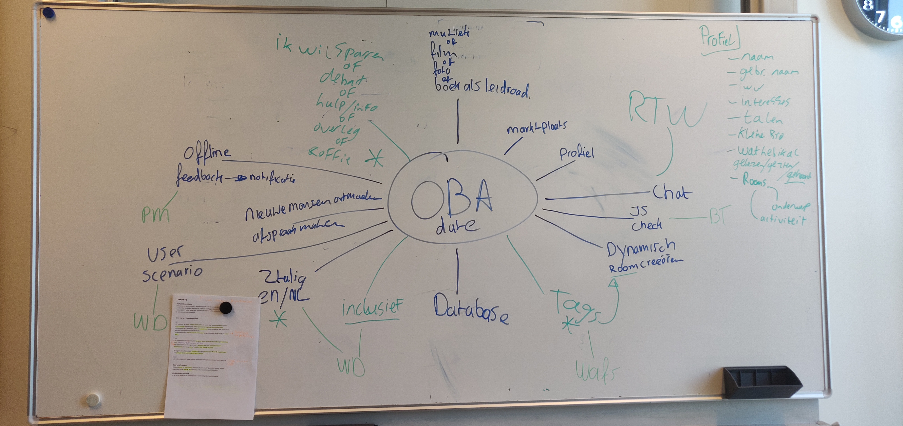

<!-- inhoud
design rationale:
- debriefing
- probleem definitie
-  uitleg van de code

productbiografie:
- iteraties - voorderingen en ideeën
- procecs
- werkwijze
- planning
-schetsen, testen, uitprobeersels, inspiratie

 -->

[Live demo](https://meesterproef-oba-date-qnwopvhidr.now.sh/)

# Inleiding
Deze repository is het directe resultaat van de assessment "Meesterproef" van de minor Web Development, uitgevoerd door studenten van de Hogeschool van Amsterdam. De opdracht is uitgevoerd voor de Openbare Bibliotheek van Amsterdam (oba).

## Inhoud
* **[Design rationale](#Design-rationale)**
* **[Productbiografie](#Productbiografie)**
* **[Ontwikkelaars](#Ontwikkelaars)**
* **[Bronnen](#Bronnen)**

# Design rationale

### Gebruikers voorbeeld:

Bart is een student economie aan de Hogeschool van Amsterdam. Tijdens zijn studie is hij regelmatig in de oba (Openbare Bibliotheek van Amsterdam) te vinden. Daar doet hij onderzoek naar zijn vakgebied en vergroot hij zijn kennis en vakbekwaamheid.

Tijdens zijn zoektocht naar kennis stuit hij regelmatig op blokkades. Dit zijn momenten waarop hij even door de bomen het bos niet meer ziet. Hij is omringt door informatie maar ziet eigenlijk door de boeken de bibliotheek niet meer.

Wat Bart tegenhoudt zijn vraagstukken waarbij meer uitleg nodig is dan die genoten wordt tijdens een zoveelste google poging. Bart heeft behoefte aan 1 op 1 contact met iemand die ervaring heeft met het desbetreffende vraagstuk. Zo kan hij sneller een onderzoek met een hogere wetenschappelijke waarde uitwerken.

* *Dit is essentieel voor Bart zijn studie omdat hij graag goed wilt presteren.*

Dankzij de nieuwe webapplicatie van de oba kan Bart dit bewerkstelligen. Door middel van het aanmaken van een bericht op het prikbord kan Jantje een oproep plaatsen met zijn vraagstuk. Hierdoor kunnen andere gebruikers zich bekend maken met zijn probleem en hem te hulp schieten. Zij kunnen reageren op het bericht en indien gewenst hem ontmoeten in de oba om hem ook fysiek bijstaan indien nodig en indien beide dat willen.

* *Hierdoor kan Bart met behulp van andermans kennis met betrekking tot literatuur en dergelijke sneller bij de informatie terechtkomen die hem gaat helpen zijn onderzoek sterker te maken met de juiste informatie en inzichten van gelijkgestemden.*

Naast dat Bart een oproep kan plaatsen voor zijn hulpvraag is het voor hem ook mogelijk om in contact te komen met gelijkgestemden om bijvoorbeeld een informeel bakje koffie te drinken en gezellig te praten of om contact te leggen met iemand die graag wilt sparren over een bepaald onderwerp waar Bart ook geïnteresseerd in is.

### Stakeholders:

| Naam / Organisatie | Functie | Belang  |
| ------ | ------ | ------ |
| _Mark OBA_ | Mark is de contactpersoon bij de oba. Met hem wordt wekelijks onderzocht in hoeverre de applicatie tijdens het ontwikkelingsproces aan de eisen en behoeften van de oba voldoet. Mark geeft de eindbeoordeling namens de oba. |Mark legt verantwoording af aan het bestuur van de oba. Mark heeft er belang bij dat de ontwikkeling van de applicatie zoveel mogelijk in lijn ligt met de wensen, doelgroepen en huidige toepassingen van de oba |
| _Openbare Bibliotheek van Amsterdam_ | Dit is de opdrachtgever. De Openbare Bibliotheek van Amsterdam | De oba heeft er belang bij dat de applicatie geschikt is om haar doelgroep te dienen. Tevens is het van belang dat de aangeboden producten en diensten van de oba bereikbaar moet zijn en de gebruikersinterface toegankelijk en transparant.
| _Vereniging van Openbare Bibliotheken_ | De VOB werkt aan de gemeenschappelijke belangen van de openbare bibliotheken en ondersteund daarmee de diensten aan zo’n 6 miljoen gebruikers. (1) | De VOB heeft er belang bij dat deze applicatie inzetbaar is bij meerdere bibliotheken en niet uitsluitend de oba.
| _Stichting Bibliotheekwerk_ | Stichting Bibliotheek werk is opgericht als een arbeidsmarkt- en ontwikkelingsfonds. Het heeft als doel bibliotheken en werknemers te ondersteunen bij het bevorderen van een goed functionerende arbeidsmarkt in de branche openbare bibliotheken. (2) | Stichting Bibliotheekwerk heeft er belang bij dat werknemers in de bibliotheken in staat zijn om hun werk goed uit te voeren. Hierbij ontstaat het belang dat ook medewerkers zo goed mogelijk met de applicatie moeten kunnen werken.
|  _Doelgroep_. Bezoekers van de oba. Hieronder worden verstaan: Nationale Studenten - Internationale Studenten - Docenten - Leer Gierigen - Overige bezoekers van de oba.  | De functie van deze belanghebbenden valt enerzijds te omschrijven als ‘kennis zoekenden’ en anderzijds als ‘kennis schikkenden’. het betreft personen die producten van de oba gebruiken, hebben gebruikt of willen gebruiken en daarbij van contact met 3e partijen niet vervreemd zijn. | De bezoekers van de oba zijn de partij die het meest vertegenwoordigd is als eindgebruikers van de applicatie. Hun belang staat er bij dat de applicatie inzetbaar moet zijn voor verschillende culturele achtergronden vakdomeinen en expertises waarbij tevens rekening gehouden moet worden met de toegankelijkheid van de applicatie en de bereikbaarheid van de informatie die aangeboden wordt door medegebruikers en de oba.
| _Hogeschool van Amsterdam_ | De Hogeschool van Amsterdam is de aannemer van het studieproject en heeft deze doorgespeeld aan de minor Web Development die op haar beurt verantwoordelijk is voor de meesterproef. | De Hogeschool van Amsterdam heeft er belang bij dat de applicatie geschikt is voor toepassing in ‘de echte wereld’. De applicatie moet professioneel ontwikkeld zijn en voldoen aan de eisen van de minor Web Development en de wensen van de opdrachtgever (oba).
| _Gemeente Amsterdam_ | De gemeente Amsterdam is het bestuursorgaan welke verantwoordelijkheid heeft over de uitvoerende werkzaamheden van de oba. | De gemeente Amsterdam heeft er belang bij dat de applicatie een gunstige progressieve toepassing biedt voor het vrije verkeer van informatie en daarmee de doelstellingen van de oba ondersteunt.
| _Joep Gravemaker_ _Stan Ooms_ | Uitvoerend producenten en ontwikkelaars van de meesterproef en deze applicatie. | Het belang van Stan en Joep is het uitvoeren van een professioneel opgezet ontwikkelingsproces waarbij aan het einde van de meesterproef een voldoende als eindbeoordeling genoten mag worden.
| _Janno Kapritsias_ | Coach gedurende de meesterproef. Janno is tevens het aanspreekpunt voor feedback. Met Janno is er wekelijks een feedback moment waarop gereflecteerd wordt op de doelstellingen en waarmee de progressie in kaart gebracht wordt. | Het belang van Janno is wekelijks resultaten te zien krijgen zodat hij mondeling zo goed mogelijk zijn feedback aan de uitvoerend producenten kan beargumenteren. Van belang is hierbij de kwaliteit van de documentatie van het ontwikkelingsproces (productbiografie) |

### User Requirements

De gebruikers zijn de bezoekers van de oba. Hieronder valt een grote diverse groep mensen met verschillende beweegredenen om de oba te bezoeken en een grote ‘culturele’ diversiteit. Studenten, scholieren, docenten, onderzoekers, leergierigen, werknemers en werkgevers van alle vakgebieden en stromingen. Het zijn mensen die op zoek zijn naar kennis en hier al stappen voor hebben ondernomen door naar de oba te gaan en zich fysiek te bewegen naar nieuwe kennis. Maar het zijn ook mensen die veel baat hebben bij een klein duwtje in de rug, een opzetje of een hulpstuk. Dit hulpstuk zorgt ervoor dat zij makkelijker contact kunnen leggen met onbekenden die zonder dat zij het zelf doorhebben ook op zoek zijn kennis en ook wel eens vast zijn gelopen. Het zijn ervaringsdeskundigen die weten hoe frustrerend het kan zijn als je vastloopt terwijl je toewijding je nog even niet naar huis laat gaan. Het zijn personen die vooral elkaars situatie en vraagstukken goed kunnen begrijpen en hier graag positief op reageren. Het zijn mensen die zichzelf uitdagen, ondernemend en vastberadenheid tonen om hun doelstelling te bereiken. Het zijn mensen die er tijdens hun werk en/of vrije tijd zitten en niet voor niets.

### Privacy

Voor de gebruikers van deze applicatie en opdrachtgever is het correct bewaren van persoonlijke gegevens een belangrijk aspect.  Om aan de wet Algemene Verordening Gegevensbescherming (AVG) te voldoen is het van belang een sterk document op te stellen waarin  de verschillende onderdelen waaraan gegevensverwerkers moeten voldoen aan bod komen.

### Feature List

De volgende features zijn nodig in het eindproduct om tot een succesvolle afsluiting te komen.
De belangrijkste features zijn: Het aanmaken van een bericht en deze opslaan in een database en het faciliteren van de mogelijkheid tot reageren op berichten met en zonder verwijzingen naar oba documenten die online beschikbaar zijn vanuit de API van de oba database.

De hieropvolgende features zijn geïmplementeerd:

1. Het aanmaken van verschillende berichten uit 3 categorieën: "hulp vragen", "hulp aanbieden", "samen iets doen".
2. Het toevoegen van zoektermen (tags) aan het bericht.
3. Het toevoegen van een afbeelding aan het bericht.
4. Het toevoegen van een titel aan het bericht.
5. Het toevoegen van een gebruikersnaam aan het bericht.
6. Het toevoegen van reacties aan berichten
7. Het opslaan van reeds gemaakte berichten in een database.
8. Real-time updaten van de user-interface wanneer nieuwe berichten geplaats worden.
9. Real-time updaten van de user-interface wanneer nieuwe reacties geplaatst worden.
10. Responsiveness van de user-interface bij verschillende viewport afmetingen.
11. De gebruiker krijgt visuele feedback wanneer hij/zij invalide informatie invult bij het aanmaken van een bericht.

# Productbiografie

## Iteraties
De ontwikkelaars en opdrachtgevers zijn verschillende keren bijeen gekomen om de voortgang van het process te bespreken. Hierbij was met name de feedback van de opdrachtgever op het geleverde werk van belang.

----

## Process
### Conceptfase
De conceptfase vond plaats vanaf het begin van de meesterproef tot week 3. Tijdens deze fase werd de nadruk gelegd op deskresearch en design. Wij hebben onszelf de volgende vragen gesteld:
- Hoe moet de applicatie werken?
- Welk design benadrukt de functionaliteit goed?
- Hoe kunnen wij het eindproduct zo gebruiksvriendelijk mogelijk maken?

Deze vragen hebben wij kunnen beantwoorden door nauw samen te werken met de opdrachtgever en intuïtief feedback te verwerken. Daarnaast is www.oba.nl ( homepage van de opdrachtgever ) gebruikt als bron voor verschillende designkeuzes. Styling van knoppen, invoervelden, lettertypes zijn gebaseerd op elementen die daar in weergegeven zijn. Dit is gedaan om consistentie te bewaken binnen de user-interface en de applicatie een "oba-look" en "oba-feel" te geven.

Hieruit zijn verschillende ontwerpen naar voren gekomen. Deze bevatten zowel design als technische specificaties:

**Brainstormsessie**

- _Het doel hiervan was bepalen welke features volgens de opgegeven user stories het belangrijkst zijn om te implementeren. Verder zijn er ook "nice-to-haves" ontdekt._

Resultaat brainstormsessie:_

**Wireframes**

-  _Om een goed beeld te krijgen van de stappen die een gebruiker af gaat leggen zijn wireframes ontworpen met geschetste content:_

**Data Life Cyclus**

- _Door een schets te maken van de data-life-cyclus is er meer begrip ontstaan over hoe de back-end van de applicatie eruit moet zien. Met name: Wat wordt er opgeslagen? Waarom en welke functies zijn er nodig om deze data te gebruiken:_

---

### Productiefase

---

## Werkwijze

Voor het uitvoeren van deze meesterproef is er een hoofdvraag opgesteld:

* _Hoe kan de bezoeker van de oba op een intuïtieve en toegankelijke wijze contact maken met andere bezoekers van de oba om hiermee in een eigen behoefte te voorzien?_

Deze hoofdvraag is gedurende het gehele process in het achterhoofd gehouden. Tijdens de uitvoering zijn wij op meerdere subvragen gestuit waarmee een applicatie ontwikkeld kon worden die deze hoofdvraag beantwoord:

* _Hoe kan de applicatie het beste benut worden met zo min mogelijk persoonlijke informatie over de gebruiker?_

* _Hoe maak je aan de gebruiker duidelijk hoe de applicatie gebruikt dient te worden?_

* _Wat maakt deze applicatie toegankelijk? Hoe moet hiervoor de "flow" van het gebruiken van de features zijn ingericht?_

Tijdens het process zijn er tussen de ontwikkelaars onderling, tussen de ontwikkelaars en de coach en tussen de ontwikkelaars en de opdrachtgever concrete afspraken gemaakt met betrekking tot werkwijze. Hieronder worden verstaan:

| Personen | Afspraak | Belang  |
| ------ | ------ | ------ |
| _Ontwikkelaars_ | 5 dagen per week samenkomen om te werken aan de meesterproef | Hiermee kan een consistente wekelijkse oplevering van resultaten plaatsvinden |
| _Ontwikkelaars en opdrachtgever_ | Meerdere malen per week samenkomen voor een feedbackmoment. De frequentie hiervan is afhankelijk van de hoeveelheid tijd die beide partijen hiervoor beschikbaar hadden. Dit kwam doorgaans uit op minstens 2-3 keer per week. | Door met regelmaat samen te komen en feedback te genieten van de opdrachtgever kan er makkelijker geïtereerd worden op het process doordat de hoeveelheid feedback per samenkomst kleiner wordt naarmate men vaker samenkomt.
| _Ontwikkelaars en coach_ | Minimaal 1 maal per week samenkomen voor een feedback/voortgangsgesprek. | Hierdoor kan er goed bijgehouden worden hoe "het" er voor staat. Dit is van belang omdat er meer werk gewenst is dan dat mogelijk binnen de termijn van de meesterproef. Indien nodig kunnen op deze momenten belangrijke beslissingen en afwegingen gemaakt worden in overleg met de coach |

Alle bovengenoemde personen zijn gedurende het gehele process bereikbaar geweest via het communicatieplatform
[Slack](https://www.slack.com).

## Planning

| Week | Fase | Taak |Persoon  |
| ------ | ------ | ------ | ------ |
|1| Concept | Applicatie Uitdenken en schetsen | Joep, Stan ||
|2| Concept |Applicatie Uitdenken en schetsen| Joep, Stan | |
|3| Concept | Applicatie Ontwerpen in Adobe XD| Joep ||
||| Basisstructuur opzetten| Stan |  
|4| Productie || ||
|5| Productie || ||

# Ontwikkelaars
## Stan Ooms

Hallo! Mijn naam is Stan Ooms. Tijdens mijn HBO opleiding voeding en new product management ontstond mijn interesse in Web Development. Wat ooit begon als een hobby is nu uitgegroeit tot dagelijkse bezigheid tijdens de minor Web Development aan de HvA. Ik wil mijzelf hierin graag verder blijven ontwikkelen in beide vakgebieden. Mijn ambitie is om beide eindjes aan elkaar te knopen en daarmee nieuwe webapplicaties te bouwen die gemaakt zijn om de voedingsmiddelenbranche verder te digitaliseren.

## Joep Gravemaker
Ik ben Joep Gravemaker, geboren en getogen in IJmuiden. Na mijn opleiding als grafisch vormgever te hebben afgerond, wilde ik meer. Ik was opzoek naar een nieuwe uitdaging, en deze heb ik gevonden in web-development. Ik vind het leukst om met zowel technisch als vormgeven bezig te zijn. Ik probeer me daarom ook zo goed mogelijk neer te zetten als frontend developer. Ik heb nog veel te leren, maar ik ben en blijf gretig.

# Bronnen
1. Over de VOB. Vereniging van Openbare Bibliotheken. 12-09-2018. www.debibliotheken.nl/de-vob/over-ons/over-de-vob/
2. Bibliotheekwerk. Vereniging van Openbare Bibliotheken. 19-12-2018. http://www.debibliotheken.nl/de-vob/vertegenwoordigingen/bibliotheekwerk/
